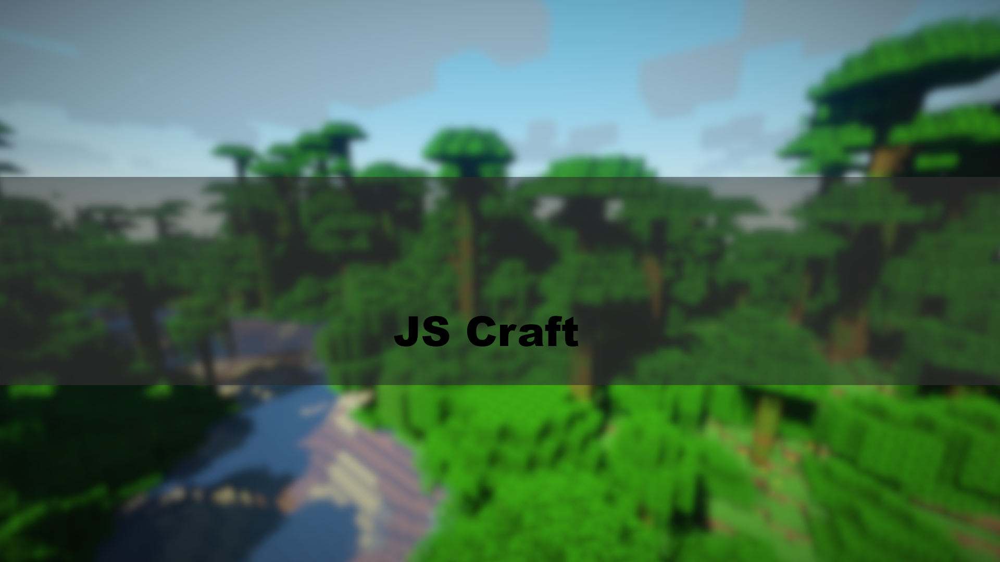

    

<h1>JSCraft - Minecraft Server</h1>

[jscraft.mc](https://github.com/NowhereLTD/jscraft) |
[Docs]() |
[Changelog]() |
[Wiki]() |
[Contributing]()

[][CIUrl]
[![Discord][DiscordBadge]][DiscordUrl]
[![Twitter][Twitter1Url]][Twitter1Badge]
[![Twitter][Twitter2Url]][Twitter2Badge]

[DiscordBadge]: https://img.shields.io/discord/dfdsj?label=Discord&logo=discord&logoColor=white
[Twitter1Badge]: https://twitter.com/prooxey
[Twitter2Badge]: https://twitter.com/DrMchack

[CIUrl]: https://github.com/NowhereLTD/jscraft/actions
[DiscordUrl]: test
[Twitter1Url]: https://img.shields.io/twitter/follow/prooxey.svg?style=flatl&label=Follow&logo=twitter&logoColor=white&color=1da1f2
[Twitter2Url]: https://img.shields.io/twitter/follow/DrMchack.svg?style=flatl&label=Follow&logo=twitter&logoColor=white&color=1da1f2